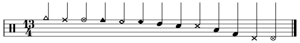
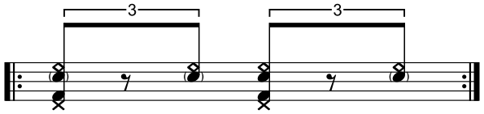
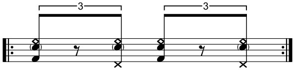
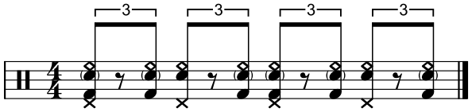
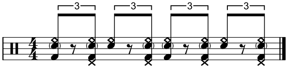

# 🥁 Drum Sheet Library

A personal library of sheet music and practice material for drums. It currently includes transcriptions of recorded music and a section on shuffle grooves, with more sections and material to be added as the library grows.

## Note legend

  

<em>Notes are numbered from left to right in the above image.</em>

<table align="center">
  <thead>
    <tr>
      <th align="center">No.</th>
      <th align="left">Note</th>
      <th align="center">No.</th>
      <th align="left">Note</th>
      <th align="center">No.</th>
      <th align="left">Note</th>
    </tr>
  </thead>
  <tbody>
    <tr>
      <td align="center">1</td>
      <td>Crash</td>
      <td align="center">6</td>
      <td>Ride (bell)</td>
      <td align="center">11</td>
      <td>Tom (floor)</td>
    </tr>
    <tr>
      <td align="center">2</td>
      <td>Hi-hat (closed)</td>
      <td align="center">7</td>
      <td>Ride (crash)</td>
      <td align="center">12</td>
      <td>Kick</td>
    </tr>
    <tr>
      <td align="center">3</td>
      <td>Hi-hat (open)</td>
      <td align="center">8</td>
      <td>Tom (rack)</td>
      <td align="center">13</td>
      <td>Hi-hat foot (closed)</td>
    </tr>
    <tr>
      <td align="center">4</td>
      <td>Cowbell</td>
      <td align="center">9</td>
      <td>Snare</td>
      <td align="center">14</td>
      <td>Hi-hat foot (splashed)</td>
    </tr>
    <tr>
      <td align="center">5</td>
      <td>Ride (bow)</td>
      <td align="center">10</td>
      <td>Crosstick</td>
      <td></td>
      <td></td>
    </tr>
  </tbody>
</table>

 

## Transcriptions

The transcriptions below cover select sections of studio recordings and are intended as interpretations and starting points for further exploration rather than note-for-note transcriptions.

&emsp;[<strong>Led Zeppelin</strong> | 'Custard Pie'](transcriptions/led_zeppelin-custard_pie/README.md) 
&emsp;[<strong>Led Zeppelin</strong> | 'No Quarter'](transcriptions/led_zeppelin-no_quarter/README.md) 
&emsp;[<strong>Led Zeppelin</strong> | 'Whole Lotta Love'](transcriptions/led_zeppelin-whole_lotta_love/README.md) 
 

## Pattern focus: Shuffles

### Texas shuffles

Here, a Texas shuffle is defined solely by its snare pattern: accents on beats 2 and 4, with all other notes played as ghost notes. The accompanying kick, ride, and hi-hat patterns may vary. Practice transitioning seamlessly between any two patterns in the table below, which combines common kick and hi-hat-foot patterns.

<table align="center">
  <thead>
    <tr>
      <th></th>
      <th>
        
HH&nbsp;foot&nbsp;on downbeat

      </th>
      <th>
        
HH&nbsp;foot&nbsp;on upbeat

      </th>
    </tr>
  </thead>
  <tbody>
    <tr>
      <td><strong>Straight&nbsp;kick pattern</strong></td>
      <td align="center">
        
      </td>
      <td align="center">
        
      </td>
    </tr>
    <tr>
      <td><strong>Syncopated&nbsp;kick pattern</strong></td>
      <td align="center">
        
      </td>
      <td align="center">
        
      </td>
    </tr>
  </tbody>
</table>
