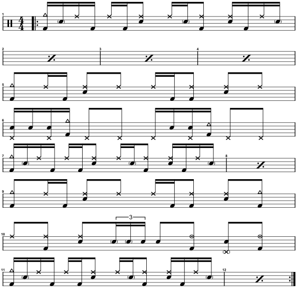
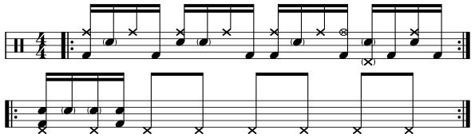
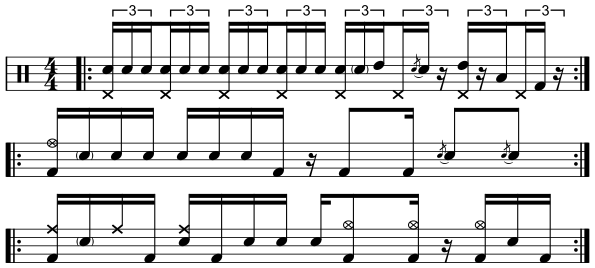

# 🥁 Drum Sheets

A personal library of sheet music and practice material for drums.

## Note legend

  

<em>The notes are numbered from left to right in the image.</em>

<table align="center">
  <thead>
    <tr>
      <th align="center">No.</th>
      <th align="left">Note</th>
      <th align="center">No.</th>
      <th align="left">Note</th>
      <th align="center">No.</th>
      <th align="left">Note</th>
    </tr>
  </thead>
  <tbody>
    <tr>
      <td align="center">1</td>
      <td>Crash</td>
      <td align="center">6</td>
      <td>Ride (bell)</td>
      <td align="center">11</td>
      <td>Tom (low)</td>
    </tr>
    <tr>
      <td align="center">2</td>
      <td>Hi-hat (closed)</td>
      <td align="center">7</td>
      <td>Ride (crash)</td>
      <td align="center">12</td>
      <td>Kick</td>
    </tr>
    <tr>
      <td align="center">3</td>
      <td>Hi-hat (open)</td>
      <td align="center">8</td>
      <td>Tom (high)</td>
      <td align="center">13</td>
      <td>Hi-hat foot (closed)</td>
    </tr>
    <tr>
      <td align="center">4</td>
      <td>Cowbell</td>
      <td align="center">9</td>
      <td>Snare</td>
      <td align="center">14</td>
      <td>Hi-hat foot (splashed)</td>
    </tr>
    <tr>
      <td align="center">5</td>
      <td>Ride (bow)</td>
      <td align="center">10</td>
      <td>Crosstick</td>
      <td></td>
      <td></td>
    </tr>
  </tbody>
</table>

## Transcriptions

The transcriptions below cover select sections of studio recordings and are intended as interpretations and starting points for further exploration rather than note-for-note transcriptions.

<strong>Led Zeppelin | 'Custard Pie'</strong>

<h2>Led Zeppelin | 'Custard Pie'</h2>
<table>
  <tbody>
    <tr>
      <td align="right"><strong>Album</strong></td>
      <td>Physical Graffiti (1975)</td>
    </tr>
    <tr>
      <td align="right"><strong>Audio</strong></td>
      <td>
        <a href="https://open.spotify.com/track/6hBtPaRGLbIE4Q6OPbj5ds?si=ad9eba4ce04a4685">Spotify</a>
        /
        <a href="https://www.youtube.com/watch?v=kPjDqylUUpQ&list=RDkPjDqylUUpQ&start_radio=1">YouTube</a>
      </td>
    </tr>
    <tr>
      <td align="right"><strong>Tempo</strong></td>
      <td>♩= 92 BPM</td>
    </tr>
  </tbody>
</table>

  

  

> **NOTE:** In the repeat measures (bars 2–4, 8, and 12), repeat the groove without the crash cymbal on beat 1.

<strong>Led Zeppelin | 'Whole Lotta Love'</strong>

<h2>Led Zeppelin | 'Whole Lotta Love'</h2>
<table>
  <tbody>
    <tr>
      <td align="right"><strong>Album</strong></td>
      <td>Led Zeppelin II (1969)</td>
    </tr>
    <tr>
      <td align="right"><strong>Audio</strong></td>
      <td>
        <a href="https://open.spotify.com/track/3OuMIIFP5TxM8tLXMWYPGV?si=477b29ba266e4242">Spotify</a>
        /
        <a href="https://www.youtube.com/watch?v=HibBnC6SVk8&list=RDHibBnC6SVk8&start_radio=1">YouTube</a>
      </td>
    </tr>
    <tr>
      <td align="right"><strong>Tempo</strong></td>
      <td>♩= 92 BPM</td>
    </tr>
  </tbody>
</table>

  

  

> 💡 Use the second groove as a vamp for improvisation.

  

  

## Pattern focus: Texas shuffles

Here, a Texas shuffle is defined solely by its snare pattern: accents on beats 2 and 4, with all other notes played as ghost notes. The accompanying kick, ride, and hi-hat patterns may vary. Practice transitioning seamlessly between any two patterns in the table below, which combines common kick and hi-hat-foot patterns.

<table align="center">
  <thead>
    <tr>
      <th></th>
      <th>
        
HH foot on downbeat

      </th>
      <th>
        
HH foot on upbeat

      </th>
    </tr>
  </thead>
  <tbody>
    <tr>
      <td><strong>Straight&nbsp;kick pattern</strong></td>
      <td align="center">
        
      </td>
      <td align="center">
        
      </td>
    </tr>
    <tr>
      <td><strong>Syncopated&nbsp;kick pattern</strong></td>
      <td align="center">
        
      </td>
      <td align="center">
        
      </td>
    </tr>
  </tbody>
</table>
